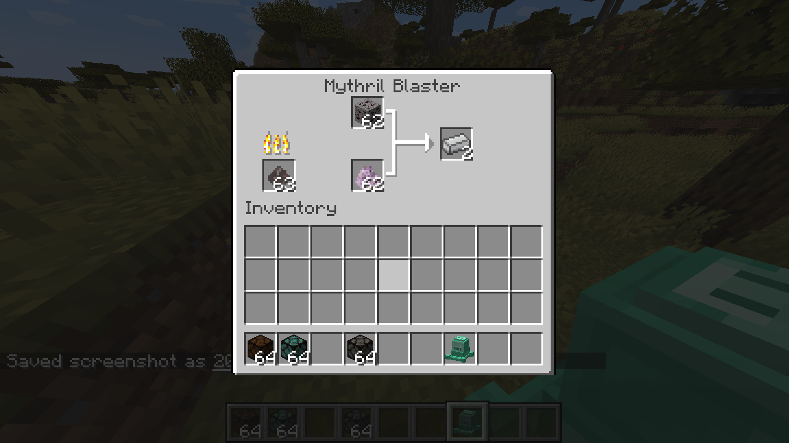
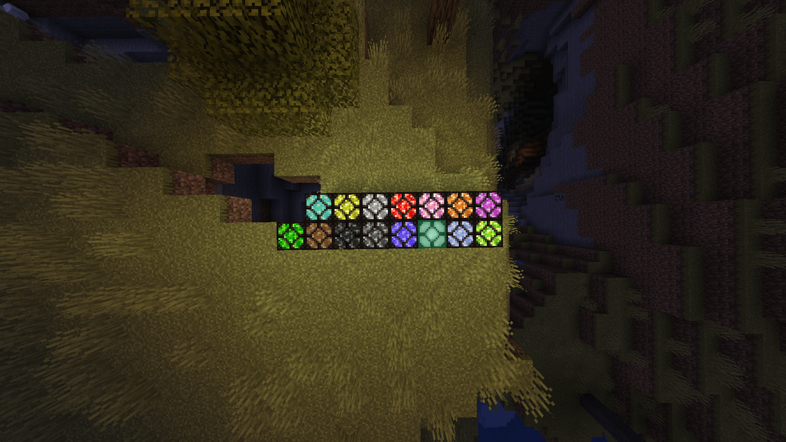
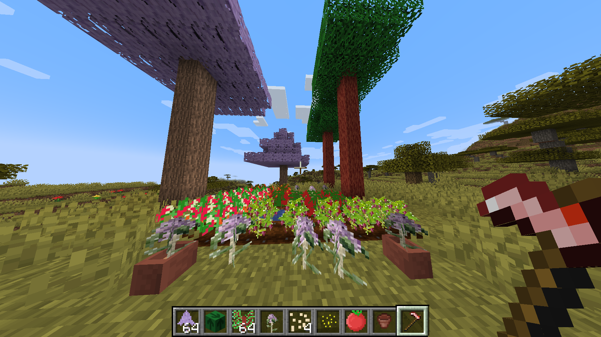
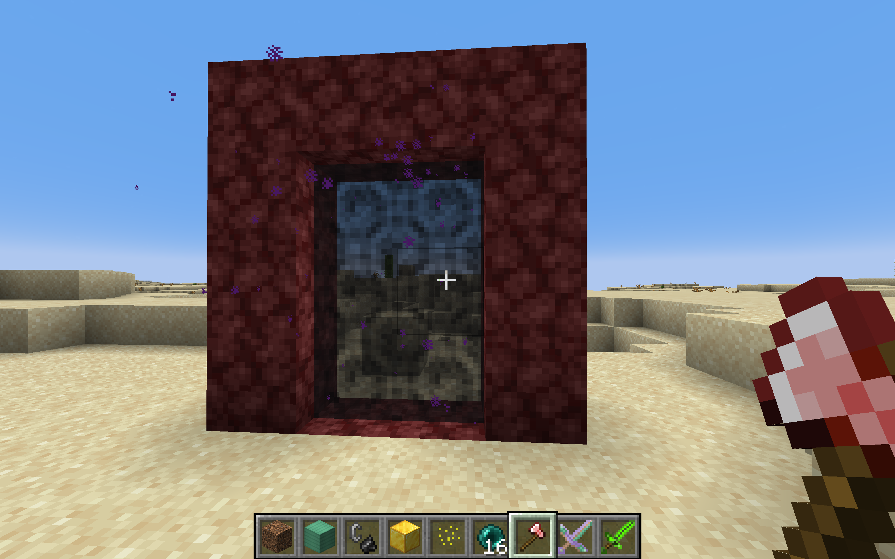
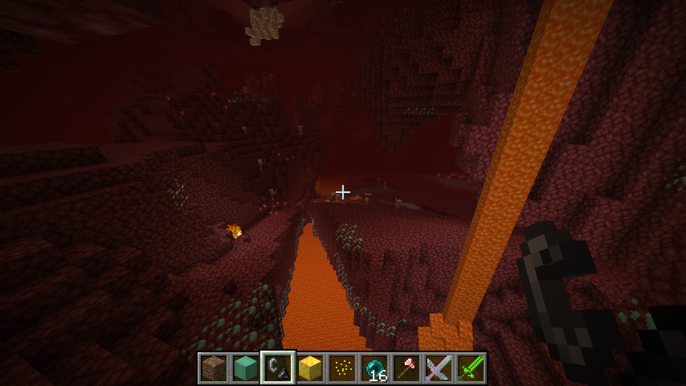
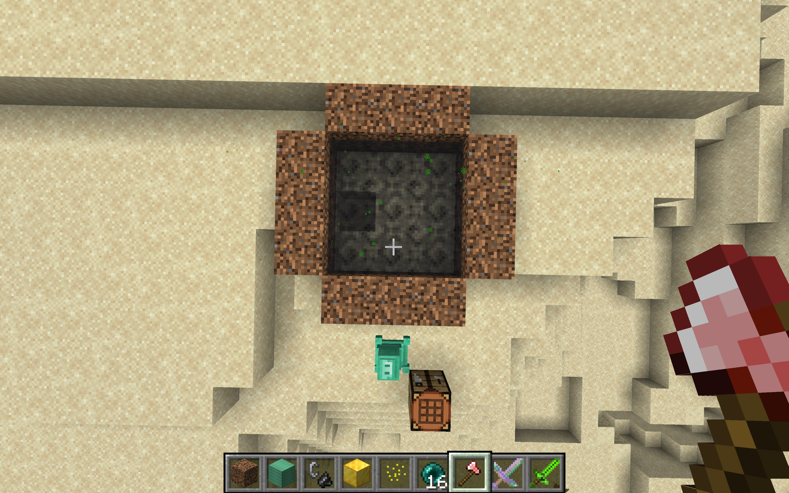
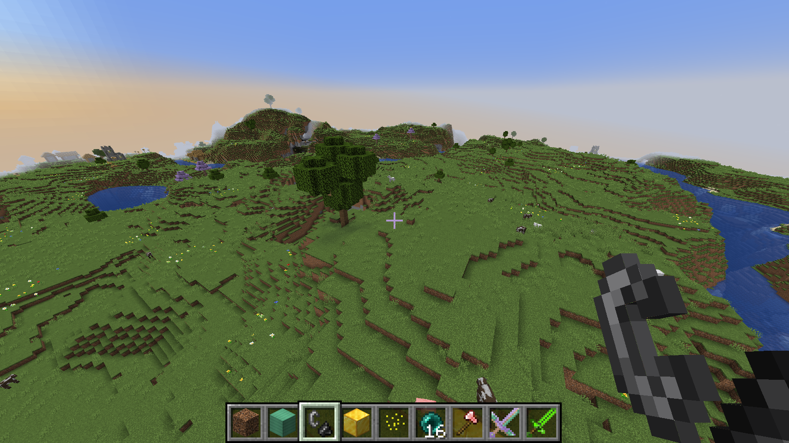
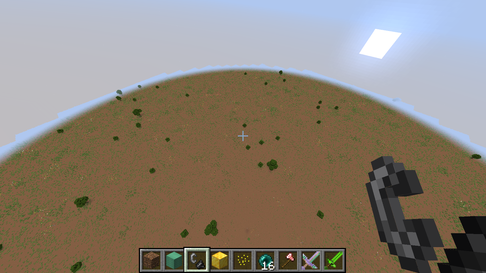
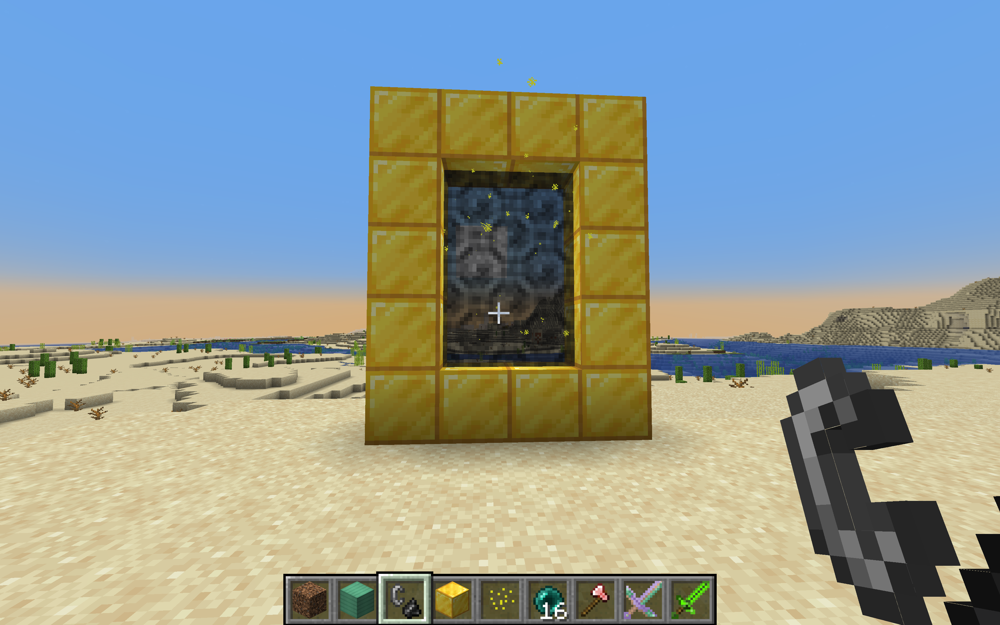
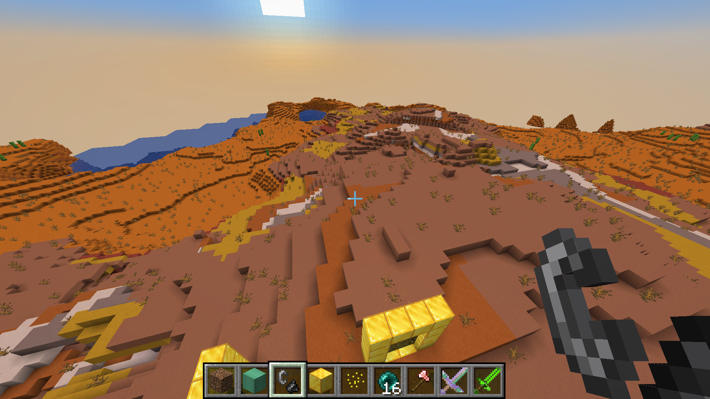

# NOTICE

If there are two files ending with .jar in the releases secion, the one you should download is the one that does **NOT** say "Sources" after it!

# CREDITS

If making a fork of this mod **DO NOT DELETE THE CREDITS.TXT**.

# CRAFTING RECIPES

**ALMOST** all ores can be smelted in the "Mythril Blaster" like in the image below 
# LOOT TABLES

**CREEPERS:**
Drop corrupted dust

**VANILLA GRASS:**
Drop modded seeds

# Features

This mod has added several features such as lamps that toggle on/off when right-clicked!

These lamps are called "**Mythril Lamps**" here is an example: 

**NATURE:**

This Mod adds many natural features such as: ore veins, trees, flowers, and more!\
Some examples are here:

# PORTALS AND DIMENSIONS:

**As of version 5.0.0 The Mod Has Custom Dimensions**

Thommas mod adds four vanilla-style dimensions:
The building haven, The (Kind of) safe nether,
The Gold Land, and The Forever Plains

**(Kind of) safe nether:**

**Forever Plains:**

**Building Haven:**

**Gold Land:**

